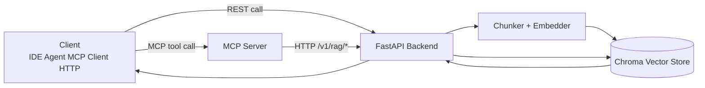
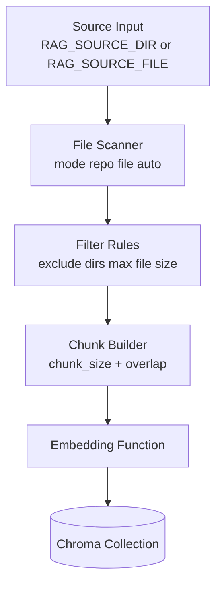
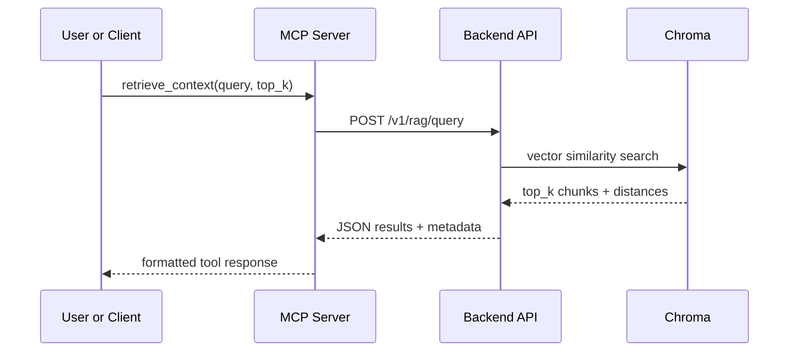

# Project RAG Gateway (MCP + REST)

This service provides a private RAG backend plus a thin MCP adapter.

Architecture:

- FastAPI backend indexes and queries repository text/code by default.
- Chroma persistent local vector store.
- MCP server exposes tools and calls backend only.
- Reverse proxy exposes REST and MCP HTTP/SSE endpoints.

Use it with any project by pointing `RAG_SOURCE_DIR` (or `RAG_SOURCE_FILE`) at your target codebase/docs.

## How MCP + RAG works

At a high level, this project has four layers:

1. Client layer: IDE agent, MCP client, curl, or app code.
1. MCP/REST interface layer: MCP server for tool calls, REST API for direct HTTP.
1. Retrieval layer: FastAPI backend orchestrates embedding and vector search.
1. Storage layer: Chroma stores chunk text, embeddings, and metadata.



### Indexing flow

Indexing converts source files into searchable vector chunks.



Detailed behavior:

- File discovery obeys `RAG_SOURCE_MODE` and reads recursively in `repo` mode.
- Files in `RAG_EXCLUDE_DIRS` are skipped early.
- Very large files are skipped using `RAG_MAX_FILE_BYTES`.
- Text is split into overlapping chunks (`RAG_CHUNK_SIZE`, `RAG_CHUNK_OVERLAP`) to preserve context across boundaries.
- Each chunk is written with metadata (`source`, `section`) for later citation.

### Query flow

Querying performs semantic search over the indexed chunks.



Scoring and citations:

- Backend converts vector distance to a simple score for readability.
- `cite_sources(chunk_ids)` resolves the exact `source` and `section` metadata for returned chunks.
- `list_sections()` provides a quick overview of indexed headings/categories.

### Why both MCP and REST

- MCP is best for agent/tool ecosystems where tool discovery and invocation are needed.
- REST is best for direct integration from scripts, CI jobs, dashboards, or custom apps.
- Both routes share the same backend and data store, so results are consistent.

### Operational model

- Keep `RAG_STARTUP_REINDEX=0` for large repos to avoid slow startup.
- Trigger indexing explicitly using `POST /v1/admin/reindex`.
- Persist vectors under `RAG_DATA_PATH` so restarts do not lose the index.
- Use scoped API keys (`query`, `sections`, `cite`, `admin:index`) for least-privilege access.

## 1) Quick start (Docker on local machine)

1. Copy environment file:

```powershell
Copy-Item .env.example .env
```

1. Set real keys in `.env` for `RAG_API_KEYS` and `RAG_MCP_SERVICE_KEY`.
1. Set `RAG_PROJECT_DIR` to the host path you want to index (default `../..`).
1. From `tools/rag_gateway` run:

```powershell
docker compose up --build
```

Exposed endpoint via proxy:

- REST: [http://localhost:8080/v1/*](http://localhost:8080/v1/)
- MCP HTTP/SSE pass-through: [http://localhost:8080/mcp/*](http://localhost:8080/mcp/)

## 2) Quick start (native local, no Docker)

From `tools/rag_gateway`:

1. Create and activate a virtual env (PowerShell):

```powershell
python -m venv .venv
.\.venv\Scripts\Activate.ps1
```

1. Install dependencies:

```powershell
python -m pip install -r requirements.txt
```

1. Copy env file and set keys:

```powershell
Copy-Item .env.example .env
```

Set `RAG_API_KEYS` and `RAG_MCP_SERVICE_KEY` in `.env`.

1. Start backend (terminal 1):

```powershell
python -m uvicorn backend.main:app --host 127.0.0.1 --port 8000
```

1. Start MCP in stdio mode (terminal 2, local client launches this too):

```powershell
$env:MCP_TRANSPORT = "stdio"
python -m mcp_server.server
```

Optional SSE mode (if you want browser/HTTP-style MCP):

```powershell
$env:MCP_TRANSPORT = "sse"
$env:MCP_HOST = "127.0.0.1"
$env:MCP_PORT = "9000"
python -m mcp_server.server
```

Native local endpoints:

- Backend REST: [http://127.0.0.1:8000/v1/*](http://127.0.0.1:8000/v1/)
- MCP SSE (optional): [http://127.0.0.1:9000/sse](http://127.0.0.1:9000/sse)

### Local path vs container path

When running without Docker, use real host paths for source and data settings.

- Native local example path styles:
  - Windows: `C:/dev/my-project`
  - Linux/macOS: `/home/user/my-project`

When running with Docker, source files are available through mounted container paths (for example `/workspace/project`).

If these are mixed up, indexing may report missing source paths.

### Native local run example (project-agnostic)

Use this PowerShell example as a template (adjust paths and keys):

```powershell
$env:RAG_BACKEND_HOST='127.0.0.1'
$env:RAG_BACKEND_PORT='8000'
$env:RAG_DATA_PATH='C:/dev/rag-data/chroma'
$env:RAG_COLLECTION='project_rag'
$env:RAG_SOURCE_MODE='repo'
$env:RAG_SOURCE_DIR='C:/dev/my-project'
$env:RAG_SOURCE_FILE='C:/dev/my-project/README.md'
$env:RAG_EXCLUDE_DIRS='.git,.venv,.rag,node_modules,target,dist,build'
$env:RAG_MAX_FILE_BYTES='1500000'
$env:RAG_STARTUP_REINDEX='0'
$env:RAG_API_KEYS='query:change-me-query:query,sections,cite;admin:change-me-admin:query,sections,cite,admin:index;mcp:change-me-mcp:query,sections,cite'

python -m uvicorn backend.main:app --host 127.0.0.1 --port 8000
```

In a second terminal, start MCP:

```powershell
$env:MCP_TRANSPORT='stdio'
$env:RAG_BACKEND_URL='http://127.0.0.1:8000'
$env:RAG_MCP_SERVICE_KEY='change-me-mcp'
python -m mcp_server.server
```

## 3) API auth

Send either:

- `Authorization: Bearer <key>`
- `X-API-Key: <key>`

Scopes:

- query
- sections
- cite
- admin:index

## 4) REST endpoints

- POST /v1/rag/query
  - body: { "query": "...", "top_k": 8 }
- GET /v1/rag/sections
- POST /v1/rag/cite
  - body: { "chunk_ids": ["..."] }
- POST /v1/admin/reindex (admin:index only)
- GET /v1/admin/health (admin:index only)

## 5) MCP tools

- retrieve_context(query, top_k)
- list_sections()
- cite_sources(chunk_ids)

Compatibility aliases are also available:

- retrieve_internal_skill(query, top_k)
- list_skill_sections()

The MCP adapter does not access Chroma directly. It only calls the backend.

## 6) Running MCP server for stdio clients

For local Claude/Copilot style clients, run:

- set MCP_TRANSPORT=stdio
- python -m mcp_server.server

Example client configs are provided:

- tools/rag_gateway/examples/mcp.local.stdio.json
- tools/rag_gateway/examples/mcp.local.sse.json

You can copy one into your VS Code user MCP config and adjust the keys/paths.

## 7) Security notes

- Do not expose Chroma storage directory.
- Keep proxy and backend private or IP-restricted.
- Rotate API keys regularly.
- Keep audit logs for queries and admin operations.
- Index only approved documents.

## 8) Source indexed by default

- Full repository from `RAG_SOURCE_DIR` (default mode is `RAG_SOURCE_MODE=repo`).

Recommended defaults for general usage:

- `RAG_SOURCE_MODE=repo`
- `RAG_SOURCE_DIR=/workspace/project` (Docker)
- `RAG_EXCLUDE_DIRS=.git,.venv,.rag,node_modules,target,dist,build`

Source controls:

- `RAG_SOURCE_MODE=repo|file|auto`
- `RAG_SOURCE_DIR` for recursive repo indexing
- `RAG_SOURCE_FILE` for single-file indexing
- `RAG_EXCLUDE_DIRS` for folders to skip
- `RAG_MAX_FILE_BYTES` to skip very large files
- `RAG_STARTUP_REINDEX=0|1` to control indexing at backend startup (default `0`)

For large repositories, keep startup reindex disabled and run manual reindex via:

- `POST /v1/admin/reindex`
